# Image-Processsing
Image processing is a method to convert an image into digital form and perform some operations on it, in order to get an enhanced image or to extract some useful information from it. It is a type of signal dispensation in which input is an image, like video frame or photograph and output, may be image or characteristics associated with that image. Usually, Image Processing system includes treating images as two-dimensional signals while applying already set signal processing methods to them. Every image is a made up of many pixels, each such pixel has RGB(red, green & blue) components whose value is between 0-255 using this crucial data many sub-operations can eb performed over the image
In this project, PIL(PILLOW) module of python has been used to perform many operations like turning image into black and white, reversing the negative image into original image and many other discussed as below:

Orginal Image : 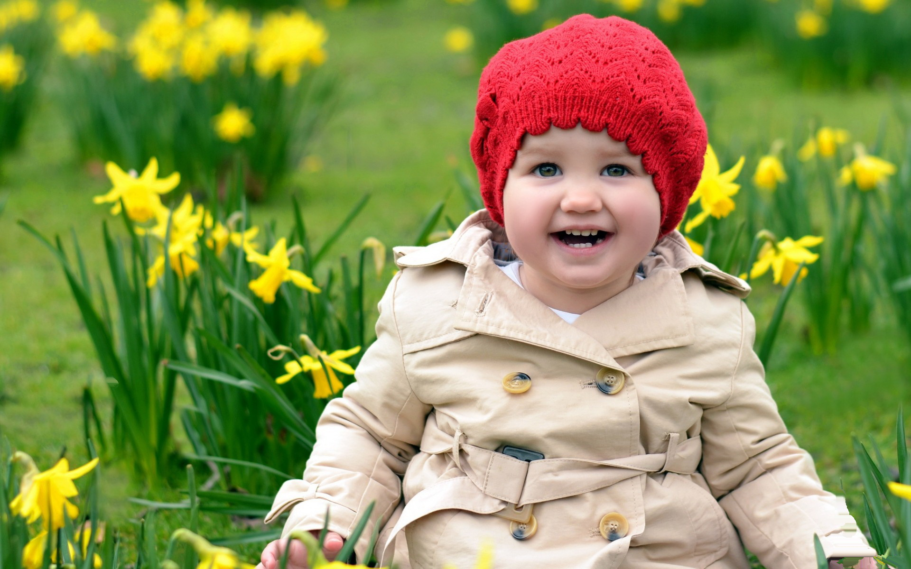
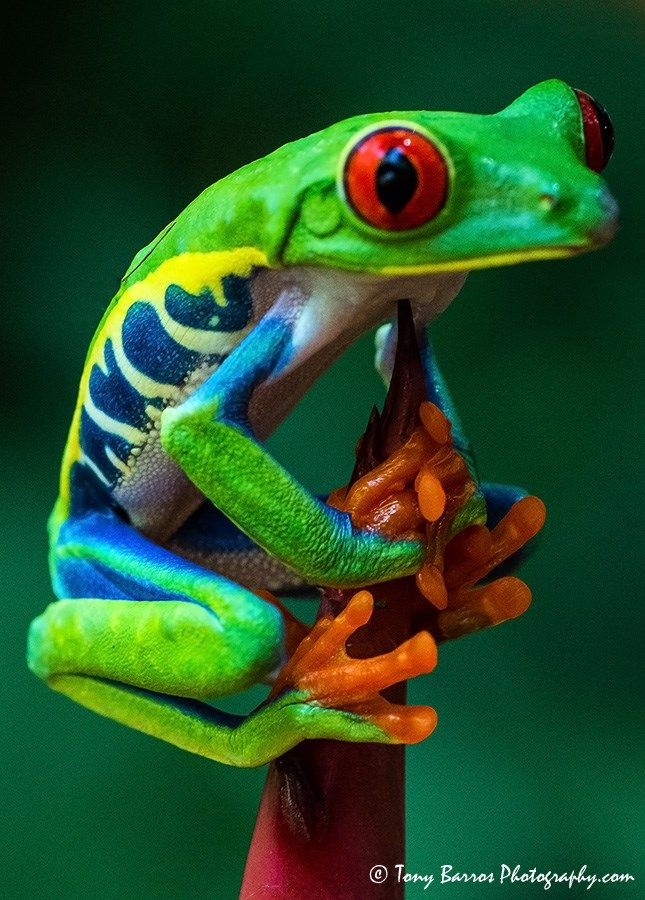
_______________________________________________________________________________________________________________________________________________________________________________
### 1.	Turning image into black and white:
        Neautral_value = (R+G+B)/3 – for each pixel in the image
        set this value as new RGB  and image is transformed into grayscale
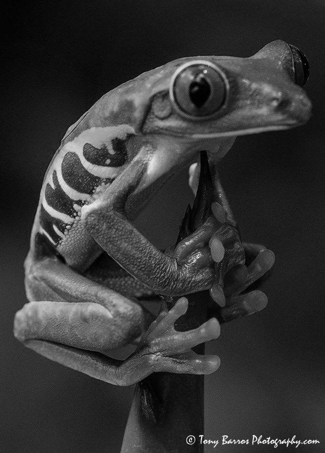

### 2.	Turing image into negative :
        For each pixel component , that is, RGB replace it with 255-component :
        R= 255-R
        G=255-G
        B=255-B
        and now update pixel with this RGB value
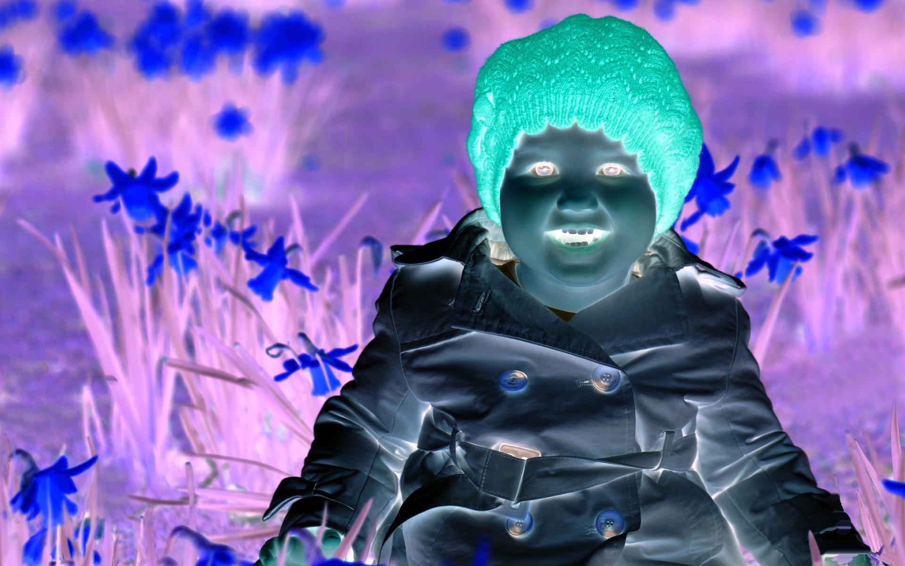

### 3.	Reverse the negative image into ordinal image:
        Similar operation of turning image into negative can be perfomed,
        since a negative image is nothing but a counter-part of the original :
        R=255-R
        G=255-G
        B=255-B
        and now update pixels with this RGB value
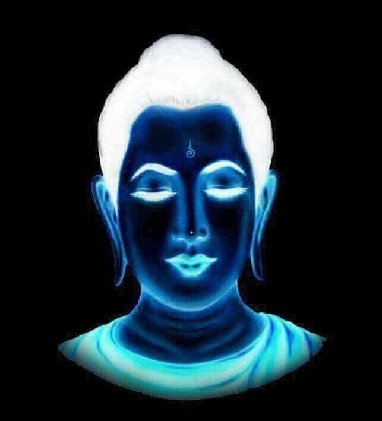
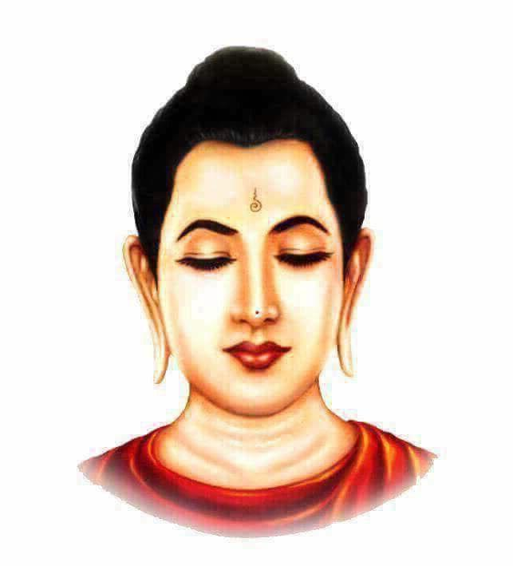

### 4.	Grainy texture in an image :
        Grainy texture actually depicts minute distortions in an image, to enhance
        the effect first convert every pixel into black and white and add random
        noise using any   Random value between 0-255
        num = any integer between 0-255
        neautral_value = (R+G+B)/3
        update the pixels with RGB of :- neautral_value + num
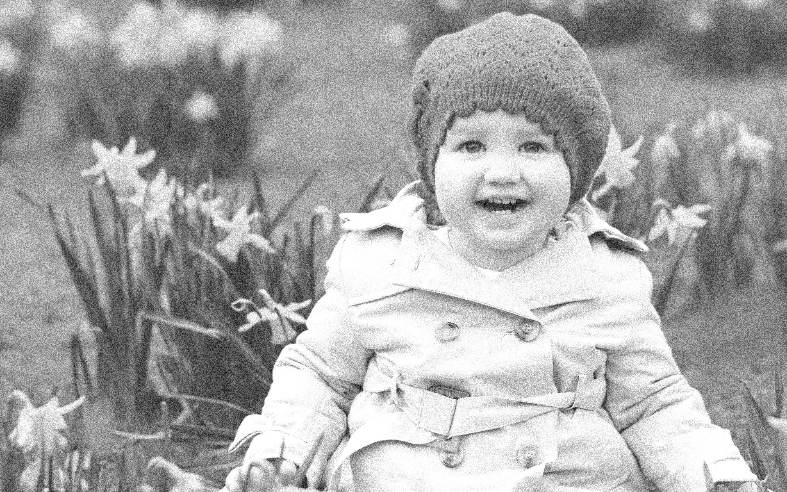

### 5.	Extracting only Red colour :
        for each pixel, calculate the value :-
               if R > (G+B) and R/2 > G then
                  update pixel as (R,neutral_value,neutral_value)
              else 
                  update pixel as complete grayscale
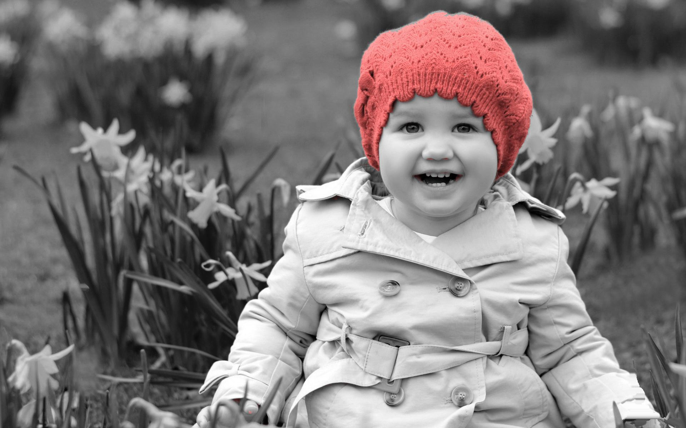
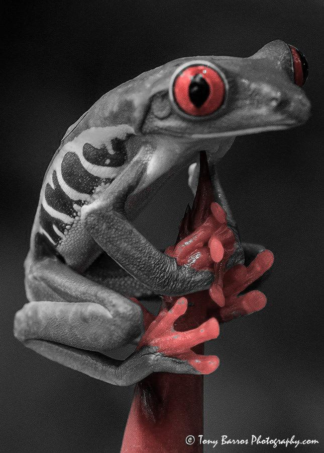

#### Similarly we can also swap R <-> B or R <-> G etc
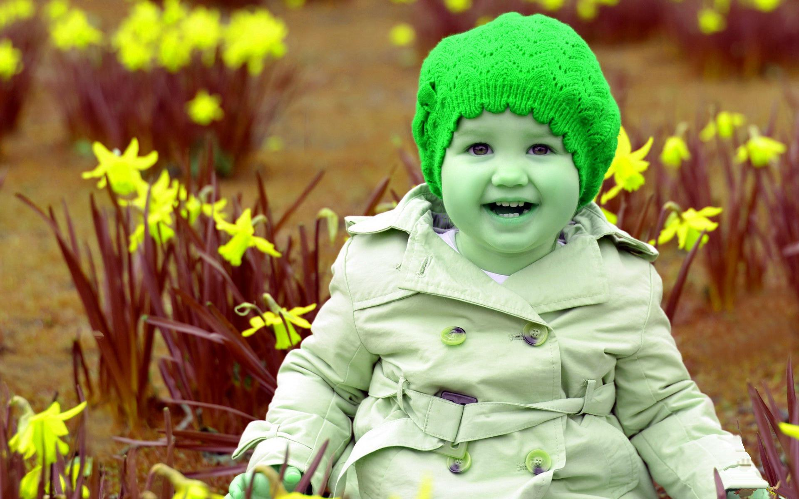
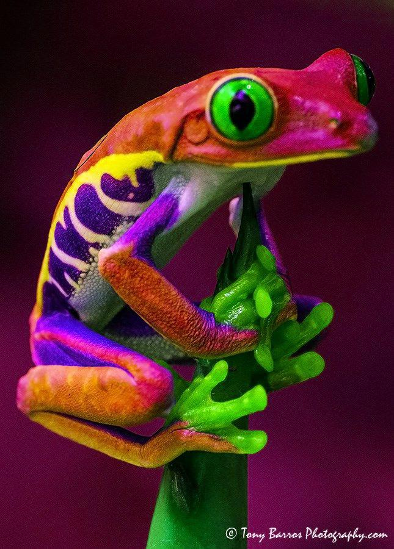
